# La Taberna de Martita — a guided tour

A web companion for D&D 5e (SRD 5.1), built for a real table rather than as a
portfolio exercise — which is why the feature list leans toward what a group
needs mid-session and away from what demos well.

**Stack** — React 19 · TanStack Router + Query · Tailwind v4 · Supabase
(Postgres, RLS, Realtime, Storage) · Vite · deployed on Vercel.

Every screenshot below is generated by
[`scripts/capture-screenshots.mjs`](../scripts/capture-screenshots.mjs) against a
seeded local stack, so they never drift from the code. The same script produces
the [Spanish set](screenshots/es/).

---

## The idea in one line

**D&D Beyond treats the character sheet as a document. This app treats it as a
scene.**

That sounds like a slogan, so here is the concrete version: where a reference
tool gives you the numbers, this one gives you the answer. Your equipment is a
figure wearing it, not a list. A fireball is a circle on the map with the names
of who is inside it, not "20-foot radius" in a description. An attack tells you
"you need an 8 or better", not "their AC is 15" plus arithmetic you do in your
head while four people wait.

The trade-off is deliberate and worth naming: D&D Beyond is built for the hours
*between* sessions — building characters, looking up rules, owning content. This
is built for the ninety minutes when everyone is at the table and the DM is
waiting on you.

---

## The character sheet

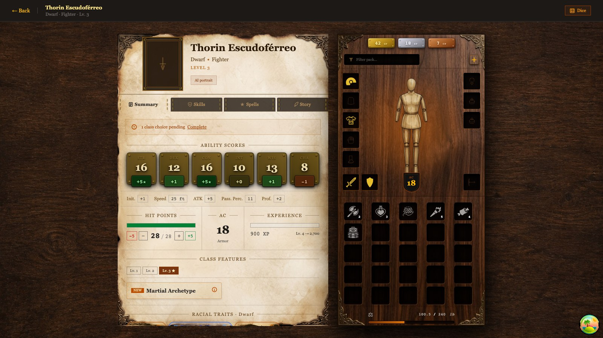

Two halves. Parchment on the left for what the character *is*; dark wood on the
right for what they are *carrying*.

The paper doll is the part people react to. Eleven equipment slots, drag and drop
via `@dnd-kit`, and the AC in the middle recalculates from what is actually
equipped — armor base, dex cap by category, shield bonus. A dwarf in chain mail
with a shield reads 18 because the app added 16 + 2, not because someone typed
18.

Small thing that took the longest to get right: `PointerSensor` needs
`activationConstraint: { distance: 6 }`. Without it every click on an item
registers as a one-pixel drag and nothing is clickable.

Every mutation on this screen is an optimistic TanStack Query update. Losing 5 HP
has to feel instant; a round trip to Supabase before the number moves is the
difference between a tool and a form.

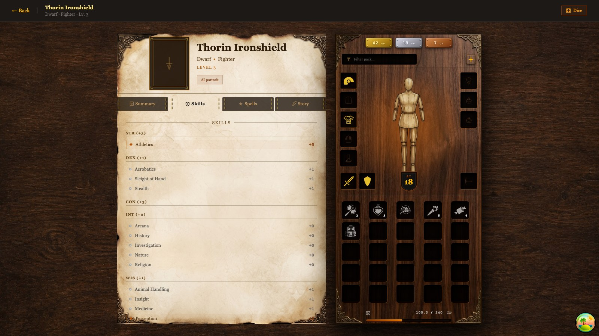

Skills grouped by their governing ability, each with the modifier already
computed from ability score, proficiency bonus, and expertise. Filled diamonds
mark proficiency, hollow circles mark the rest.

---

## Levelling up: two people, two permissions

This is the flow I would demo first, because it is the one where the design
opinion is easiest to see.

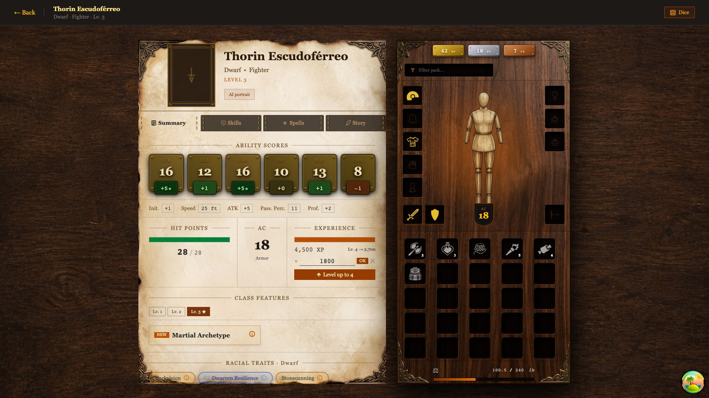

The `+ XP` control only exists for the DM. A player cannot grant themselves
experience — not by convention, by row-level security.

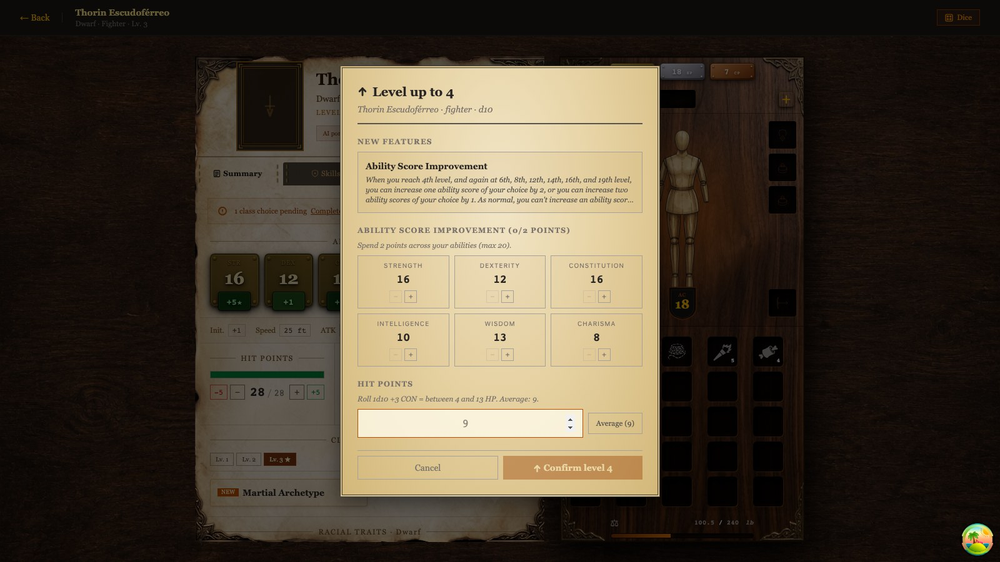

The level-up button is the mirror image: it appears on the player's own sheet,
because what you *do* with that experience is your call. The social contract of
the table is in the schema rather than in an agreement someone has to remember.

Levelling in 5e is not a button, it is a batch of coupled decisions — hit points,
subclass, ability score improvement or feat, new spells, fighting style, favored
enemy. They all appear at once, in order, and the modal will not let you confirm
until each one is resolved.

The detail I am most attached to: asking for hit points does not show an empty
field. It shows the whole decision — *"Roll 1d10 +3 CON = between 4 and 13 HP.
Average: 9."* The SRD lets you choose between rolling and taking the average, so
the app gives you both numbers instead of making you derive them.

---

## The battle map

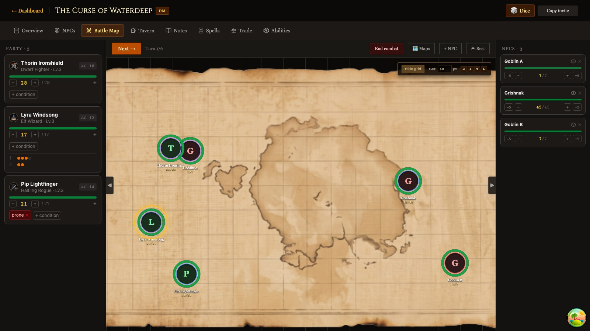

Realtime grid over an uploaded map, synced through Supabase Realtime. Party on
the left with live HP and conditions, initiative across the top, NPCs on the
right. The DM drags tokens; every player sees them move.

Token coordinates are stored as **fractions of the canvas**, not pixels, so a
position survives someone resizing their window or joining from a laptop with a
different screen. (This was also a bug: the seed file wrote pixels, they got
multiplied by the board width a second time, and the tokens landed roughly
300,000px off-screen — present in the DOM, invisible on the map. Worth mentioning
because the screenshot pipeline is what caught it.)

Combat tools that live on this screen:

- **Attack resolution.** Pick attacker and target and it answers with the d20 you
  need, the hit probability as a percentage, and the damage — including the edge
  rules, natural 1 always missing and `nat20Always` where it applies.
- **Area templates.** Spheres, cubes, cones, and lines projected onto the grid
  with automatic detection of which tokens are caught.
- **Spell slots** deducted from the caster's sheet when the spell is cast, not
  tracked separately on a piece of paper.

### Procedural encounters

Around thirty themed archetypes. Pick one and the generator builds the whole
encounter: scales monster HP and XP to the party's level, assigns tactical roles
(melee, ranged, magic, support), and places them on the grid. Loot rolls against
one of eight biome profiles, including signature items with creature identity.

Two design notes that matter more than the feature itself:

**Generating does not mean losing control.** Every monster stays editable
afterwards — HP, role, level, spells. It produces the 90% and lets you adjust the
10% that matters, rather than demanding the whole 100% up front.

**Groups can be hidden.** Each generated encounter gets a `spawn_group` UUID and a
per-token `hidden` flag. The DM sees the goblins dimmed; the players see nothing
until they are revealed. Without this a DM has two bad options: place the ambush
in the open and lose the surprise, or place it mid-scene and stop the game.

---

## The campaign hub

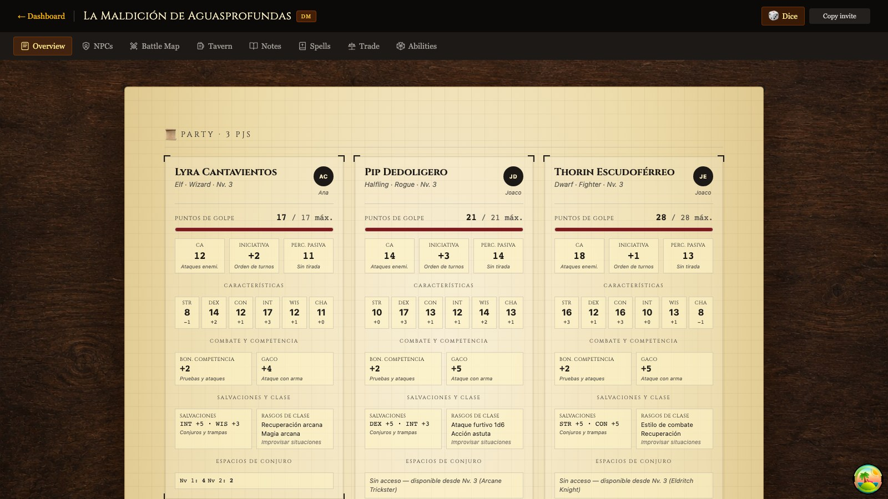

What a DM actually needs mid-session, on one screen: current HP, AC, initiative
modifier, passive Perception, saving throws, and remaining spell slots for the
whole party. No clicking into three sheets to find out whether anyone can still
cast Shield.

The tab bar is role-aware — the DM gets NPC and direction tools; players get the
reference tabs.

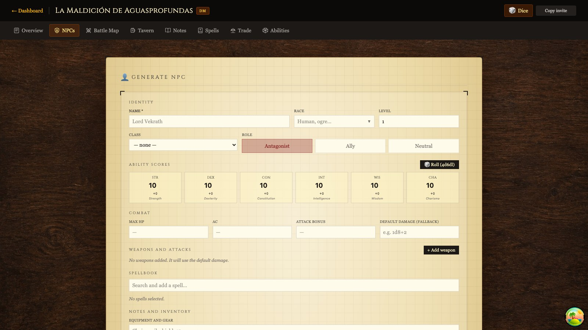

Full CRUD for NPCs with complete 5e stat blocks. HP is auto-suggested from class
and level and then editable, because a suggestion you cannot override is just a
constraint.

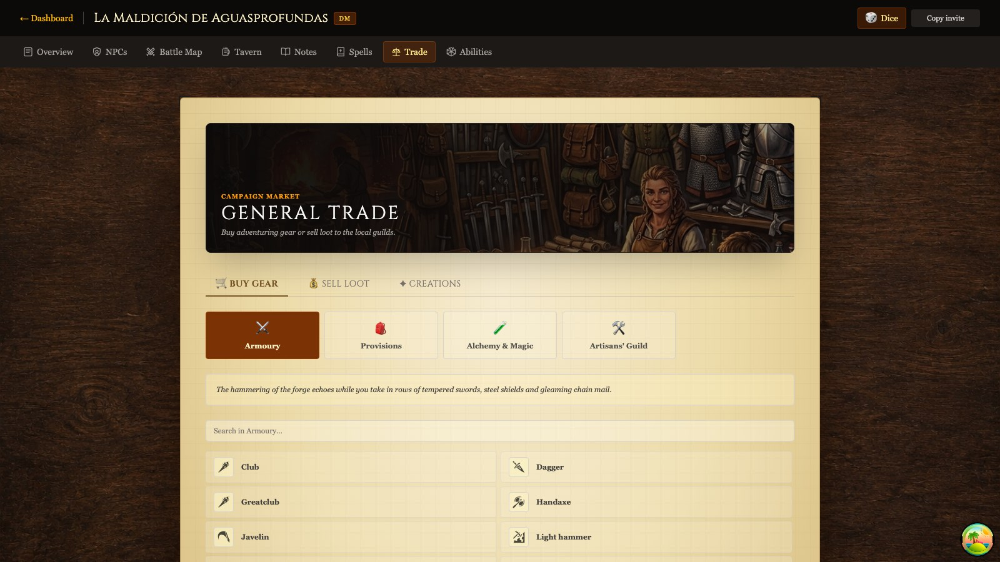

Themed shops importing equipment straight from the SRD. Purchases check funds
against the character's actual coins (all currency math normalizes to copper in
[`currency.ts`](../src/lib/currency.ts) — mixing gold, silver, and copper in
floats is how you end up with 0.30000000000000004 gold). Selling returns 50%.
DMs can design custom items with AI-generated art.

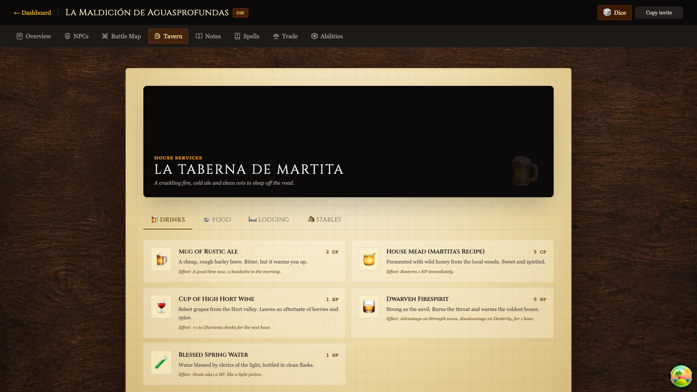

The namesake. Food, drink, and lodging with real costs; consuming one deducts
coins, applies the effect — HP, spell slot recovery on a long rest — and writes a
line to the campaign journal automatically. The stables sell mounts and gear from
the SRD.

Strictly speaking none of this needs to be software — it is bookkeeping a DM
could do out loud. Automating it turned out to matter anyway, because the
bookkeeping is exactly what nobody remembers to do.

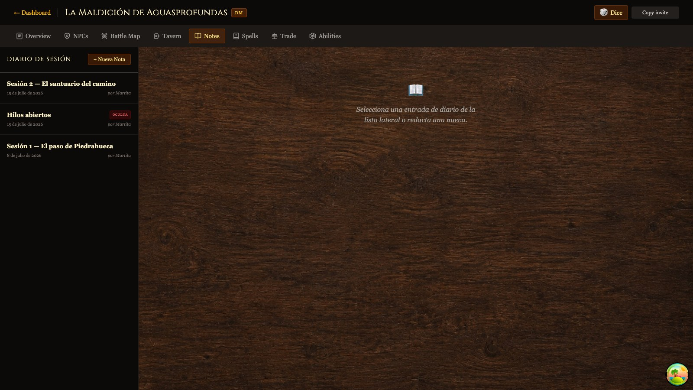

Shared journal with public and private entries. Private ones are visible to the
author and the DM — enforced in RLS policies, not in the client.

---

## Compendiums

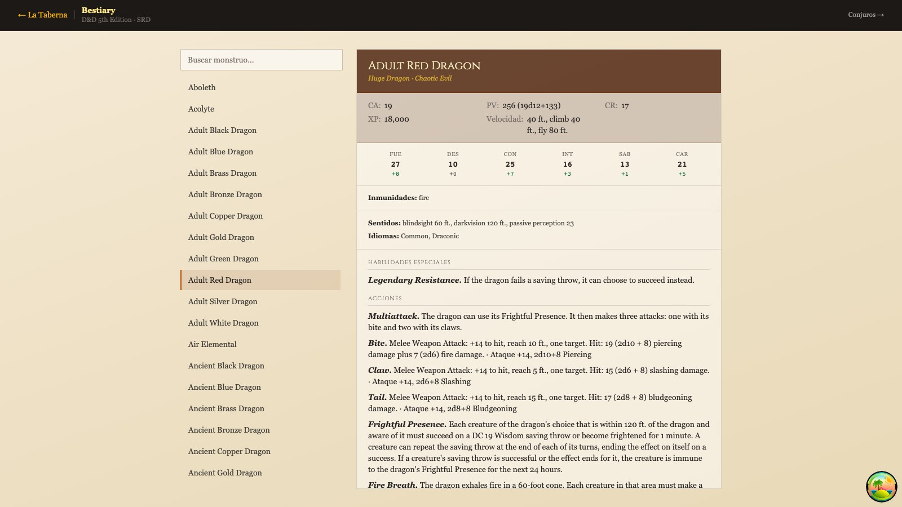

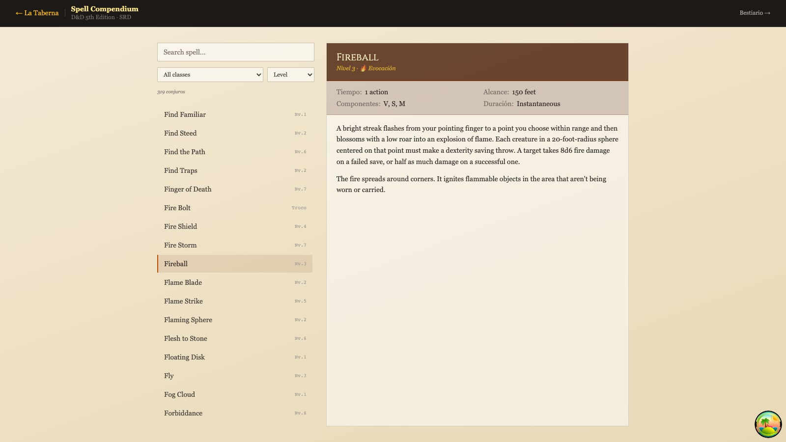

Full SRD monster stat blocks and a spell search filtered by caster class and
level. Both are cached aggressively with TanStack Query — SRD data never changes
inside a session, so `staleTime: Infinity` is correct rather than lazy.

---

## Character creation

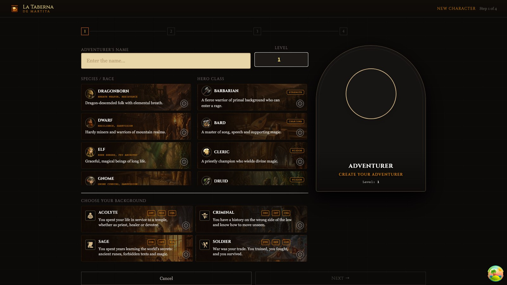

A four-to-five step wizard — the spell step only appears for casters. The right
column is a stained-glass window: race on the left half, class on the right,
background across the bottom third, updating live as you choose.

The selection cards were rebuilt as **native radio inputs inside `<label>`
elements**. They used to be `<div onClick>` with the info button nested inside,
which meant no keyboard focus, no Enter or Space, and a control nested inside
another control. Native radios gave arrow-key navigation, grouping, and state
announcement for free, and deleted every `stopPropagation()` the nesting had
required. 128 cards, one fix.

---

## Things worth knowing about the build

**Accessibility.** 100% of interactive controls are keyboard-reachable and have
accessible names, measured across 11 routes by
[`scripts/audit-a11y.mjs`](../scripts/audit-a11y.mjs) rather than asserted. The
`lang` attribute follows the selected locale, which is what tells a screen reader
which voice to use.

**Internationalization.** A typed catalog in [`src/i18n/`](../src/i18n/), no
dependency. Spanish is the source of truth and English is typed as
`Record<TranslationKey, string>`, so a missing translation fails the typecheck
instead of rendering a raw key in production. Game terms indexed by SRD key —
skills, abilities, races, classes — live separately in
[`dnd-terms.ts`](../src/lib/dnd-terms.ts), because they are content, not chrome.

**Icons.** ~130 SVGs from [game-icons.net](https://game-icons.net) (CC-BY-3.0),
resolved through a semantic cascade rather than a name-to-file table: 111
equipment concepts, 16 backgrounds, 8 spell schools. Spells resolve by school —
the SRD has 300+ spells but only 8 schools. Each icon renders as a CSS
`mask-image` over `bg-current`, so one asset reads correctly on both light
parchment and dark wood. Coverage is measured against the live SRD API: 291 of
294 items.

**Licensing.** SRD 5.1 content under CC-BY-4.0 with the attribution the license
requires, in [ATTRIBUTIONS.md](../ATTRIBUTIONS.md). Own code MIT. Not affiliated
with Wizards of the Coast.

---

## Known limitations

Stated plainly, because a tour that only lists strengths is an advertisement.

**UI language and rules language are one axis, and they should be two.** There is
a single `locale`. Content arriving from the SRD API — feature descriptions,
spell and monster names — is always English, because the API only serves English.
You can see it in the Spanish level-up screenshot: the interface is Spanish and
the *Ability Score Improvement* block is not. Splitting the axes depends on
moving the rules into a data-driven engine, which is the next planned phase.

**The rules engine is not a package yet.** Attack resolution currently lives
inside a React hook, mixed with component state. It should be a pure module with
tests against the SRD — that is exactly the kind of logic that deserves them.

**Scope honesty.** Several things here are tractable *because* this is a table of
five and not a product for millions. Eleven equipment slots with SRD items is a
much smaller problem than thousands of items across dozens of sourcebooks with
edition variants. There is no fifteen-year data migration, no backward
compatibility, no licensing contracts. Recognizing that is part of reading the
design correctly.

---

## Running it locally

```bash
pnpm install
supabase start
supabase db reset   # applies migrations + the seed campaign
pnpm dev
```

The seed creates a playable campaign: a DM, two players, three characters of
different classes with inventory and equipment, NPCs, an encounter on the board,
and session notes. Accounts are `martita@`, `thorin@`, and `lyra@taberna.test`,
password `taberna123`.

To regenerate this document's screenshots:

```bash
supabase db reset && node scripts/capture-screenshots.mjs --locale en
```
